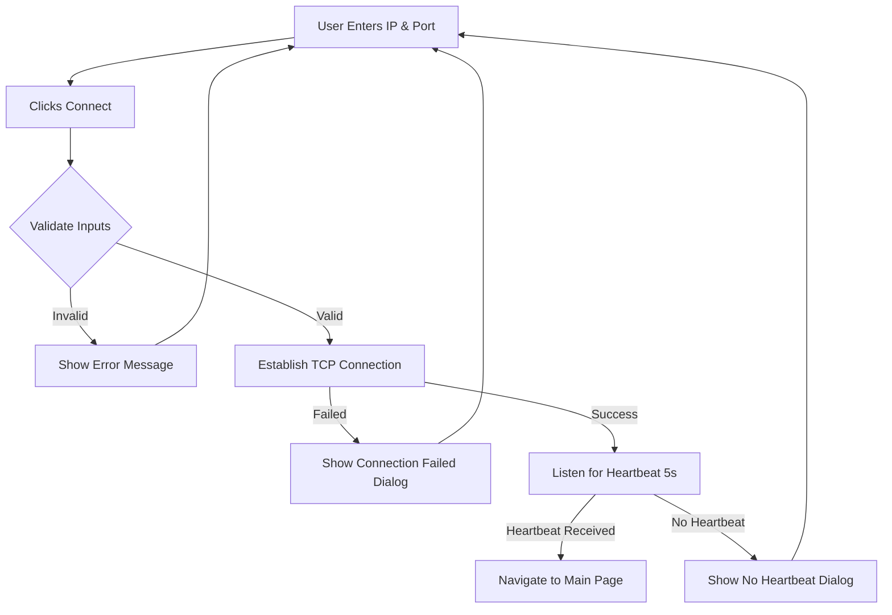

# ✅ GCS Application - Connection Page Implementation Complete

## 🎯 Summary

I've successfully created the **first page (Connection Page)** of your GCS (Ground Control Station) application with all the requested features following **MVVM architecture**.

---

## 📋 What You Asked For

✅ **1. Heading called "Connection"**
   - Implemented with large, bold typography (32sp)
   - Centered at the top of the card

✅ **2. Two Text Fields**
   - **IP Address Field**: Accepts IP address input (default: 192.168.1.100)
   - **Port Number Field**: Numeric-only input (default: 5760)
   - Both fields have proper labels, placeholders, and Material Design 3 styling

✅ **3. TCP Connection with Heartbeat Validation**
   - Establishes TCP socket connection to the specified IP and port
   - Monitors for MAVLink heartbeat packets (0xFE or 0xFD markers)
   - Only navigates to next page if heartbeat is detected within 5 seconds
   - Shows "Connection failed" error popup if no heartbeat or connection fails

✅ **4. Proper UI and Alignment**
   - Clean, centered card-based layout
   - Material Design 3 components
   - Consistent spacing (24dp between elements)
   - Elevated card with rounded corners (16dp radius)
   - Responsive design with proper padding

✅ **5. MVVM Architecture**
   - **ViewModel**: `ConnectionViewModel.kt` - Manages state and business logic
   - **View**: `ConnectionScreen.kt` - UI presentation
   - **Model**: `ConnectionState` data class - Connection state data
   - Proper separation of concerns

---

## 📁 Files Created/Modified

### New Files Created:

1. **`app/src/main/java/com/example/sampleproject/viewmodel/ConnectionViewModel.kt`**
   - Handles TCP connection logic
   - Manages connection state (connecting, connected, error)
   - Validates IP address and port
   - Monitors heartbeat packets
   - Manages socket lifecycle

2. **`app/src/main/java/com/example/sampleproject/ui/screen/ConnectionScreen.kt`**
   - Connection page UI with Material Design 3
   - IP address and port input fields
   - Connect button with loading state
   - Error dialog for connection failures
   - Info text about TCP connection

3. **`app/src/main/java/com/example/sampleproject/ui/screen/MainScreen.kt`**
   - Placeholder for the main page (Map UI + Telemetry)
   - To be implemented in the next phase

4. **`app/src/main/java/com/example/sampleproject/navigation/Screen.kt`**
   - Defines screen routes (Connection, Main)

5. **`app/src/main/java/com/example/sampleproject/navigation/AppNavigation.kt`**
   - Navigation setup using Jetpack Compose Navigation
   - Connection screen as start destination
   - Navigates to Main screen on successful connection

### Modified Files:

6. **`app/src/main/java/com/example/sampleproject/MainActivity.kt`**
   - Updated to use navigation system
   - Removed placeholder greeting code
   - Integrated AppNavigation composable

### Documentation Files:

7. **`README_CONNECTION_PAGE.md`** - Comprehensive guide
8. **`CONNECTION_PAGE_IMPLEMENTATION.md`** - Technical details
9. **`UI_DESIGN.md`** - UI layout visualization
10. **`IMPLEMENTATION_SUMMARY.md`** - This file

---

## 🏗️ Architecture Overview

```
┌─────────────────────────────────────────────┐
│           MainActivity.kt                    │
│  (Entry point, sets up navigation)          │
└───────────────┬─────────────────────────────┘
                │
                ▼
┌─────────────────────────────────────────────┐
│         AppNavigation.kt                     │
│  (Manages screen navigation)                 │
└───────┬─────────────────────────────────────┘
        │
        ├─► ConnectionScreen.kt (View)
        │        │
        │        ├─► ConnectionViewModel.kt
        │        │   (Business logic, state)
        │        │
        │        └─► ConnectionState (Model)
        │
        └─► MainScreen.kt (Placeholder)
```

---

## 🎨 UI Features

### Connection Screen Layout:

```
╔══════════════════════════════════════╗
║                                      ║
║        ┌────────────────┐           ║
║        │   Connection   │           ║
║        │                │           ║
║        │  ┌──────────┐  │           ║
║        │  │IP Address│  │           ║
║        │  └──────────┘  │           ║
║        │                │           ║
║        │  ┌──────────┐  │           ║
║        │  │   Port   │  │           ║
║        │  └──────────┘  │           ║
║        │                │           ║
║        │  [ Connect ]   │           ║
║        │                │           ║
║        │  ℹ Info text   │           ║
║        └────────────────┘           ║
║                                      ║
╚══════════════════════════════════════╝
```

### UI States:

1. **Initial State**: Fields editable, Connect button enabled
2. **Connecting State**: Fields disabled, button shows spinner + "Connecting..."
3. **Success State**: Navigates to Main screen (removes Connection from back stack)
4. **Error State**: Shows AlertDialog with error message

---

## 🔌 Connection Flow Logic



---

## 🧪 Testing Instructions

### Before Testing:
1. **Sync Project**: Open in Android Studio → File → Sync Project with Gradle Files
2. **Build Project**: Build → Make Project (Ctrl+F9)
3. **Run**: Click Run button or Shift+F10

### Test Scenarios:

#### ✅ Happy Path:
- Enter valid IP (e.g., 192.168.1.100)
- Enter valid port (e.g., 5760)
- Click Connect
- Wait for connection + heartbeat
- Should navigate to Main screen

#### ❌ Error Cases to Test:

| Test Case | Expected Behavior |
|-----------|-------------------|
| Empty IP | Show "IP address cannot be empty" |
| Invalid port (0) | Show "Invalid port number" |
| Invalid port (99999) | Show "Invalid port number" |
| Wrong IP | Show "Connection failed: Unable to connect" |
| No heartbeat | Show "No heartbeat received" after 5s |

---

## 🔧 Technical Implementation Details

### Dependencies Used:
- ✅ Jetpack Compose (UI framework)
- ✅ Navigation Compose (screen navigation)
- ✅ Lifecycle ViewModel Compose (MVVM)
- ✅ Kotlin Coroutines (async operations)
- ✅ StateFlow (reactive state management)
- ✅ Material Design 3 (UI components)

### Connection Implementation:
- Uses raw TCP `Socket` for maximum compatibility
- Connection timeout: 5 seconds
- Heartbeat detection: Looks for MAVLink packet markers (0xFE or 0xFD)
- Heartbeat timeout: 5 seconds
- Proper error handling and resource cleanup
- Automatic socket closure on ViewModel disposal

### Permissions:
- ✅ `INTERNET` - Already in AndroidManifest.xml
- ✅ `ACCESS_NETWORK_STATE` - Already in AndroidManifest.xml

---

## 📱 Screen Preview

**Connection Screen:**
- Card-based centered layout
- Primary color heading (Connection)
- Outlined text fields with rounded corners
- Primary color button with loading state
- Secondary color info text
- Material Design 3 error dialog

**Main Screen:**
- Currently shows placeholder text
- Ready for Map UI and Telemetry implementation

---

## 🚀 Next Steps (For Future Implementation)

### Phase 2: Main Screen
1. **Google Maps Integration**
   - Display interactive map
   - Show drone position marker
   - Track flight path

2. **Telemetry Data Display**
   - Battery level
   - GPS status
   - Altitude
   - Speed
   - Heading
   - Flight mode

3. **MAVLink Message Handling**
   - Parse heartbeat messages
   - Process GPS data
   - Display attitude information
   - Show system status

4. **Real-time Updates**
   - Continuous data stream from TCP connection
   - Update UI in real-time
   - Handle connection loss gracefully

---

## ✨ Key Features Highlights

### 🎯 User Experience:
- Clean, intuitive interface
- Clear loading indicators
- Helpful error messages
- Proper input validation
- Smooth navigation

### 🏗️ Code Quality:
- MVVM architecture
- Separation of concerns
- Reactive state management
- Proper error handling
- Resource cleanup
- Coroutine-based async operations

### 🔒 Robustness:
- Input validation
- Connection timeout
- Heartbeat verification
- Graceful error handling
- Memory leak prevention

---

## 📞 Support

If you encounter any issues:

1. **Import Errors**: Sync project with Gradle
2. **Build Errors**: Clean project (Build → Clean Project)
3. **Runtime Errors**: Check logcat for detailed error messages
4. **Connection Issues**: Verify IP address and network connectivity

---

## ✅ Status: COMPLETE

The **Connection Page is fully implemented and ready to test!**

All requested features have been implemented:
- ✅ Connection heading
- ✅ IP address text field
- ✅ Port number text field
- ✅ TCP connection
- ✅ Heartbeat validation
- ✅ Error popup on failure
- ✅ Navigation to next page on success
- ✅ Proper UI design and alignment
- ✅ MVVM architecture

**You can now build and run the application to test the connection page!**

---

*Implementation Date: December 19, 2025*
*Architecture: MVVM*
*Framework: Jetpack Compose*
*Language: Kotlin*

